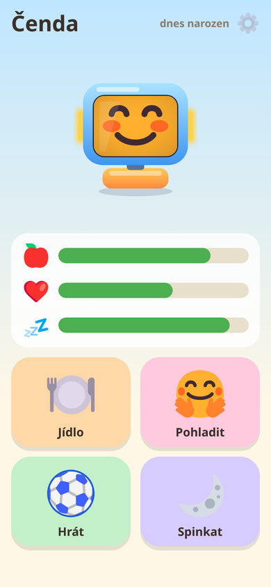
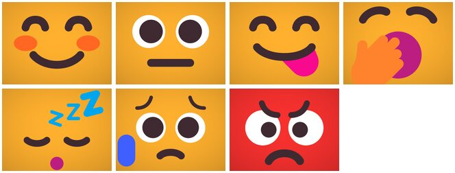

# s-w42-eu-pet

A Tamagotchi for [Stackchan](https://github.com/m5stack/StackChan) robots
running Embody Mode. The pet lives on this server; the robot is its body.
Kids play with the robot itself and with a picture page on a phone or tablet.
Parents set the daily routine behind a PIN.

It is a separate server that the robot switches to from its QR screen
(Next, then Connect). It speaks the Embody Mode protocol from
[s-w42-eu-raw](https://github.com/mj41/s-w42-eu-raw) (`wire` package).
The robot runs Embody Mode from the
[StackChan firmware fork](https://github.com/mj41/StackChan/tree/embody-mj41); setting it up:
[SETUP.md](https://github.com/mj41/StackChan/blob/embody-mj41/firmware/main/apps/app_embody_mode/SETUP.md).
It runs at [pet.sa.w42.eu](https://pet.sa.w42.eu): set your robot up on
[sm.w42.eu](https://sm.w42.eu) with the pet among its apps, or run the pet on a server at home.

| The robot's face, per mood | The kid's page |
|---|---|
|  |  |
|  | |

The faces are [Fluent Emoji](https://github.com/microsoft/fluentui-emoji) (MIT) made to fill the
robot's 4:3 screen; a parent can switch back to the robot's own face.

Part of [home-w42-eu](https://github.com/mj41/home-w42-eu), a local first, privacy
first platform for a home, as a separate app a home includes when its family wants it.

All requirements, with ids and the open decisions, are in
[docs/requirements.md](docs/requirements.md); this readme is the overview.

> **A proof of concept, vibe coded.** Written with AI agents and tested on real hardware at
> home, but neither the code nor its security has been reviewed by humans. Use it on your
> own network, and don't trust it with anything private yet.
>
> **Early stage: no backward compatibility.** Protocols, APIs, file formats and stored settings
> change when something better comes along, without migrations: update the robot's firmware
> and the servers together.
>
> **Want more?** Ask in the [issues](https://github.com/mj41/s-w42-eu-pet/issues), and ideally [sponsor mj41](https://github.com/sponsors/mj41) on GitHub:
> mj41 codes for attention food.

## Playing

| On the robot | The pet |
|---|---|
| Stroke or press the head | Tickle, cuddle, long cuddle or scratch: each its own line and fun |
| Hold an NFC card to it | Eats the card's food (it glides into the mouth); picky about the same food twice; asleep, it dreams of the food, and more cards help it sleep (+15% energy each) |
| Tap the screen | A menu: food, play (catch the ball, the color game, dance), nap, needs; a back arrow at the bottom |
| Press the screen long | "Jemně a krátce, prosím. Můj obličej je citlivý." |
| Shake it | "Wheee!", dizzy |
| Come close (proximity) | Says hello now and then |

The kid's page (`http://<server>:8770/` after scanning the robot's QR code)
works with pictures, so it needs no reading: the pet's face, three need bars
(food, fun, energy), four big buttons (food, cuddle, play, nap) and the color
game's podium. Actions from the robot show on the page too.

**Catch the ball:** five balls on the robot's screen for the kid to tap; the
head makes each one harder, up to dodging a hand that comes close
([G1–G3](docs/requirements.md#play)). **The color game:** the LED strips show colors, the kid
presses them in each level's order on the screen; the three best games make a
leaderboard with photos from the robot's camera ([G6–G8](docs/requirements.md#play)).

The head never moves while the robot is in someone's hands (the accelerometer
and gyro in its telemetry tell). It sinks at rest (the firmware lets the servos
go), and by day the pet lifts it back
([R6, R9](docs/requirements.md#what-the-robot-shows-and-says)).

Needs: food, fun and energy go from 0 to 100 and drop while the pet is awake;
its mood follows them ([N1–N6](docs/requirements.md#needs-and-mood)). The pet is kind: it never
dies or gets ill; neglected it only gets sad and asks for food or play now and
then.

## Parent page

`/parent` asks for a PIN; the first PIN entered becomes the PIN. A parent's
phone can be marked as such: it then stays unlocked until its Lock button.
Settings ([A1–A8](docs/requirements.md#parent-page)):

- name, language (Czech or English), difficulty (how fast needs drop)
- wake-up and bedtime for weekdays and weekends; optional school hours, when
  the pet rests with its screen off ("Během školy já odpočívám.")
- minutes of play per day (feeding is never limited)
- sounds, voice and volume, night light, screen off at night, night wake minutes
- food cards: tags seen by the robot, each assigned a food
- the needs themselves: sliders for food, fun and energy, or all full
- the games: seconds per ball, whether the head moves; photos for the color
  game's leaderboard, which the page lists (remove a place, clear it)
- faces on the robot (on by default): Fluent Emoji faces filling the whole screen, one per
  mood (`internal/robotpic/faces/`, made by `genfaces`); off: the robot's own blinking face
- a log of what happened, previews of the morning and bedtime routines and of every sound
- demo mode, in its own section at the bottom: a need at 90% drops back to
  10%, naps are quick (+20% in 5 s, 75% at a minute, then it wakes), and school
  hours are ignored

The daily routine: the pet yawns before bedtime, then a lullaby, good night
and a warm night light that fades out; at night a light touch gets a sleepy
"Zzz..." or a dream, and in the morning it greets and plays a tune
([D1–D7](docs/requirements.md#daily-routine)). Needs pause at night and during school hours, so
the pet never suffers while the kid sleeps or is away.

## Running

```sh
go run ./cmd/s-w42-eu-pet -tz Europe/Prague
```

| Flag | Default | |
|---|---|---|
| `-listen` | `:8770` | robots and browsers |
| `-public-url` | `http://<LAN IP>:8770` | base of the QR link |
| `-token-file` | `~/.config/stackchan-server/robot-token` | robot bearer token, generated if missing |
| `-state-file` | `~/.local/state/stackchan-pet/state.json` | pets, PINs, pairings, the leaderboard; its photos go to `photos/` next to it; `""` = memory only (no photos) |
| `-tz` | this machine's | the family's time zone for the schedule |
| `-voice-dir` | `~/.cache/stackchan-pet/voice` | where the spoken lines are kept |
| `-ffmpeg` | `ffmpeg` from `PATH` | for the Edge voice; `""` = no Edge voice |
| `-espeak` | `espeak-ng` from `PATH` | the fallback voice; `""` = none |
| `-no-voice` | off | the pet does not speak |
| `-debug-dir` | `~/.cache/stackchan-pet/screens` | screen snapshots from `POST /api/debug/{id}/run` |
| `-manager-url` | | the Stackchan manager that set robots up with a token of their own for this app, e.g. `https://sm.w42.eu`; the pet checks those tokens with it |
| `-manager-secret-file` | | this app's secret at the manager |
| `-debug` | off | debug logging |
| `-ui-dir` | | development: serve the pages from disk (`internal/app/ui`) |

The default token file is [s-w42-eu-raw](https://github.com/mj41/s-w42-eu-raw)'s,
so that server can offer the pet to its robots:

```sh
s-w42-eu-raw -offer Pet=ws://192.168.1.10:8770,$HOME/.config/stackchan-server/robot-token
```

Robots set up by a [Stackchan manager](https://github.com/mj41/s-w42-eu-manager) connect with
a token of their own for the pet, which it checks with the manager (`-manager-url`; the package
[robotauth](https://github.com/mj41/s-w42-eu-raw/tree/main/robotauth)); the debug API
(`POST /api/debug/{id}/run`) takes only the shared token. A `v*` tag builds the image
`ghcr.io/mj41/s-w42-eu-pet:<tag>` (Alpine with ffmpeg and espeak-ng for the voice).

The robot adds the offer to its server list; switching to it:
[SETUP.md, More servers and apps](https://github.com/mj41/StackChan/blob/embody-mj41/firmware/main/apps/app_embody_mode/SETUP.md#more-servers-and-apps).
Then scan the pet's QR code with the kid's phone.

## Layout

- `internal/pet`: the model (needs, schedule, moods, actions), no I/O
- `internal/app`: robot connections, the engine (robot events → pet actions,
  moods → face, speech, LEDs, sounds), the robot's menus (`menu.go`), the games
  (`game.go`, `colorgame.go`), the leaderboard photos (`photos.go`), the
  watchdog that keeps the robot in step (`watchdog.go`), holding detection
  (`held.go`), the debug endpoint (`debug.go`), HTTP API, pages in `ui/`
- `internal/voice`: the Edge read-aloud client, the ffmpeg robot filter, the cache
- `internal/sound`: synthesized sounds, 16 kHz PCM, each under the robot's 3 s buffer
- `internal/robotpic`: pictures for the robot's screen (needs, food, menu tiles,
  game buttons, the level and podium pictures) and the LED colors

The pet speaks its lines: Microsoft Edge's read-aloud voice (Czech: Antonín, a
little higher and faster, English: Ana), made a bit robot by ffmpeg (40% of a
robotized copy mixed in). Each line is made once and kept in `-voice-dir`; at
start the pet makes all its fixed lines ahead of time. Without Edge (offline) it
falls back to espeak-ng. The speech is streamed to the robot at speaking pace.
The robot's speech bubble font has no Czech letters: the bubble shows the
lines without diacritics.

The pet on the pages is a tiny Stackchan (`internal/app/ui/chan/`, drawn for
this project after the robot) showing the same Fluent Emoji faces as the robot
(see its `NOTICE`). Stackchan is developed and
published by meganetaaan, https://github.com/meganetaaan/stack-chan; the
character is used under its
[derivative work guideline](https://github.com/rt-net/stack-chan/blob/main/GUIDELINE.md),
which asks for that credit where users see it (the pages show it).

Other pictures are [Fluent Emoji Flat](https://github.com/microsoft/fluentui-emoji)
(MIT, `internal/app/ui/emoji/LICENSE`); `internal/robotpic/render-icons.sh`
renders the PNGs for the robot's screen, and the robot's faces: `genfaces` takes the mood
emoji, drops the round head and fills the 4:3 screen with its colour.

The pet keeps its pictures in the robot's file store (folder `pet/`): at
connect it asks for the robot's file list and uploads what is missing or
changed (compared by CRC-32), so later it can show them without sending them
again.

## Development

```sh
gofmt -l . && go vet ./... && go test -race ./...
```

The protocol comes from `github.com/mj41/s-w42-eu-raw/wire`. To work on both at
once, clone it next to this repo and add an uncommitted `go.work`
(`go work init . ../s-w42-eu-raw`).

## Related projects

- [StackChan fork, branch `embody-mj41`](https://github.com/mj41/StackChan/tree/embody-mj41): the robot's firmware, Embody Mode.
- [s-w42-eu-raw](https://github.com/mj41/s-w42-eu-raw): the `wire` package, and the full dashboard, which offers the pet to its robots.
- [s-w42-eu-sbot](https://github.com/mj41/s-w42-eu-sbot): another app server on the same protocol (a cockpit for the robot and a TPBot car).
- [home-w42-eu](https://github.com/mj41/home-w42-eu): the platform this is part of. All the repos: [The repos today](https://github.com/mj41/home-w42-eu#the-repos-today).

Stack-chan (スタックチャン) is a registered trademark of Shinya Ishikawa; this project is independent and only made to work with [Stack-chan](https://github.com/stack-chan/stack-chan) robots.

## License

MIT, see [LICENSE](LICENSE).
